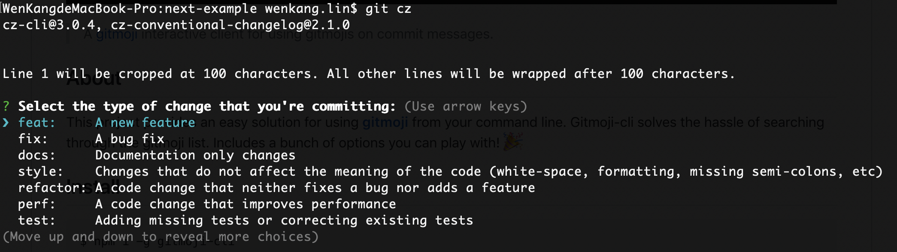
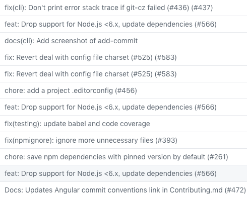

# Git 的学与记：工程化配置 commit 规范 <!-- omit in toc -->

> 使用版本说明：
>
> - git: 2.19.0
> - @commitlint/cli: 7.2.1
> - @commitlint/config-conventional 7.1.2
> - @commitlint/prompt 7.2.1
> - @commitlint/prompt-cli 7.2.1
> - cz-conventional-changelog 2.1.0
> - husky 1.1.3
> - lint-staged 8.0.4

如果你团队的 git commit 信息紊乱，太过糟糕，觉得有必要统一规范 commit 格式，又或者你是一个强迫症患者，有必要让 commit 信息整整齐齐的展示。那么，你可以往下瞄瞄。

---

* [git commit 规范格式](#git-commit-规范格式)
* [用于 commit 规范的工具](#用于-commit-规范的工具)
* [commitizen 使用](#commitizen-使用)
* [commitlint 使用](#commitlint-使用)
* [最终使用版本](#最终使用版本)

---

## git commit 规范格式

以我多年捉急的经验，比较大众化的 commit 格式无非有两种：

```shell
$ <commit-type>[(commit-scope)]: <commit-message>
$ <commit-icon>: <commit-message>
```

- `<commit-type>` 常见为：
  - chore：构建配置相关。
  - docs：文档相关。
  - feat：添加新功能。
  - fix：修复 bug。
  - pref：性能相关。
  - refactor：代码重构，一般如果不是其他类型的 commit，都可以归为重构。
  - revert：分支回溯。
  - style：样式相关。
  - test：测试相关。
- `[(commit-scope)]` 可选，表示范围，例如：`refactor(cli)`，表示关于 cli 部分的代码重构。
- `<commit-message>` 提交记录的信息，有些规范可能会要求首字母大写。
- `<commit-icon>` 用图标来替代 `<commit-type>` 所表示的功能。

所以，你可能经常可以在 GitHub 上看到类似下面的 commit 格式信息：

```shell
feat: add a new feature xxx
fix: fix issue xxx
refactor: rewrite the code of xxx
fix(testing): correct testing code of xxx

# 有些 commit 信息首字母会大写
feat: Add a new feature xxx
fix: Fix issue xxx
refactor: Rewrite the code of xxx
fix(testing): Correct testing code of xxx

# 有些使用 icon 来替代 commit 类型
:sparkles: Add a new feature
:bug: Fix issue xxx
:recycle: Rewrite the code of xxx
```

## 用于 commit 规范的工具

偷偷的展示一些我的收藏：

- [commitizen](https://github.com/commitizen/cz-cli)
- [commitlint](https://github.com/marionebl/commitlint)
- [gitmoji](https://github.com/carloscuesta/gitmoji-cli)

第三种是使用 `<commit-icon>` 来展示信息，接下来我会介绍第一种和第二种的使用方式，怎么使用来让我们感觉到舒舒服服地。

## commitizen 使用

根据官方文档的介绍，尝试全局安装下面的包：

```shell
yarn global add commitizen # npm install -g commitizen
```

成功后，可以在 git 项目中全局使用 `git-cz` 命令，或者 `git cz`，可能会出现如下图所示：



注意这里是有可能，个人经历，有可能不好使，因为可能不是一个 `a Commitizen friendly repository` （官方说法）。那么接下来演示如何变成一个友好的库。

首先，我个人喜欢本地安装 `commitizen`，喜欢全局安装的同志们可以忽略：

```shell
yarn add commitizen --dev # npm i commitizen --save-dev
```

然后，执行下面的命令来自动安装&配置 `cz-conventional-changelog`：

```shell
./node_modules/.bin/commitizen init cz-conventional-changelog --yarn --dev

# or npm
./node_modules/.bin/commitizen init cz-conventional-changelog --save-dev

# or npx
npx commitizen init cz-conventional-changelog --yarn --dev

# or 如果你已经全局安装了 commitizen
commitizen init cz-conventional-changelog --yarn --dev
```

上面的命令做了两项操作：

1. 通过 `npm` 或 `yarn` 安装了包依赖 `cz-conventional-changelog`。
2. 在 `package.json` 中自动配置了如下内容：

```json
"config": {
  "commitizen": {
    "path": "./node_modules/cz-conventional-changelog"
  }
}
```

其实你完全可以自己手动来处理，首先安装依赖包：

```shell
yarn add cz-conventional-changelog --dev
```

然后在 `package.json` 文件中加入上面的配置，结果是一样的。

> `cz-conventional-changelog` 这玩意被官方称为“adapter”，翻译为适配器。

最后执行 `git-cz` 命令，或者添加到 `scripts` 中，执行 `yarn commit` 命令：

```json
"scripts": {
  "commit": "git-cz"
}
```

一番 commit 下来，项目的 commit 记录看起来效果如下：



官方还很臭美的贴了一个 badge 图标链接，可以放到项目首页中以示“我是一个 a Commitizen friendly repository”：

```shell
[](http://commitizen.github.io/cz-cli/)
```

上面的操作如果都成功的话，那么项目中就可以使用 `git-cz` 命令，或者 `yarn commit` 命令来取代 `git commit` 命令了。但是不足的是：

1. 项目中依旧可以继续使用 `git commit` 命令来提交不规范的信息，很可能项目中的同事会忘记，导致继续使用 `git commit` 来提交代码。
2. 图片中可以发现，有些 commit 信息首字母大写，有些 commit 信息首字母小写，所以并不能强制要求大小写的规范。

这你能接受吗？反正我不能接受，不能接受的你们，可以继续往下瞄。

## commitlint 使用

```shell
yarn add @commitlint/config-conventional @commitlint/cli --dev
```

在专门的 `commitlint` 配置文件 `commitlint.config.js` 中配置如下：

```js
module.exports = {
  extends: ['@commitlint/config-conventional']
};
```

类似于 `eslint`，`commitlint` 还支持类似于 `.commitlintrc.js`、`.commitlintrc.json`、`.commitlintrc.yml` 名称的配置文件，又或者在 `package.json` 中添加 `commitlint` 字段。

然后安装 [husky](https://github.com/typicode/husky)，这是为了添加 git hooks，使得 `git commit` 也能够符合 commit 规范。

```shell
yarn add husky --dev
```

在 `package.json` 中配置 `husky` 钩子：

```json
{
  "husky": {
    "hooks": {
      "commit-msg": "commitlint -E HUSKY_GIT_PARAMS"
    }
  }
}
```

上面的操作如果都成功的话，那么你使用 `git commit` 命令时，就必须老老实实的使用符合 `commitlint` 规范的信息了。嗯？有没有像 `git-cz` 这种弹窗交互式的命令工具呢？有：

```shell
yarn add @commitlint/prompt-cli --dev
```

然后在 `package.json` 中配置 `scripts`:

```json
{
  "scripts": {
    "commit": "commit"
  }
}
```

这样，你就可以执行 `yarn commit` 命令来更方便的提交符合规范的 commit 信息了。至此，`commitlint` 解决了在 `commitizen` 中不足之处的第一点和第二点，不论是 `git commit`，还是 `yarn commit`，提交的内容都是符合规范的。

但是，有更多要求的你想要 `<commit-message>` 首字母是大写的，有更多要求的他想要 `<commit-message>` 首字母是小写的，对于不同的使用者，满足不同的规范需求，该咋整呢？

不墨迹了，还记得上面的 `commitlint.config.js` 文件吗？我说过和 `eslint` 很像，所以你懂的，`commitlint` 也支持 `rules` 配置。你可以通过设置规则 `subject-case` 来满足刚才的需求：

```js
// commitlint.config.js
module.exports = {
  extends: ['@commitlint/config-conventional'],
  rules: {
    'subject-case': [2, 'always', ['upper-case']]
  }
};
```

上面的配置，表示 `<commit-message>` 必须首字母大写，如果你要小写，配置如下：

```js
// commitlint.config.js
module.exports = {
  extends: ['@commitlint/config-conventional'],
  rules: {
    'subject-case': [2, 'never', ['upper-case']]
  }
};
```

更多 rules 配置，请查看：

> https://marionebl.github.io/commitlint/#/reference-rules

> :information_source: 使用 `@commitlint/config-conventional` 后，默认 `<commit-message>` 是小写的规范。

所以，你完全可以自己 diy，配置出你觉得满意的 commit 规范。

## 最终使用版本

想不到的是，你可以结合使用 `commitizen` 和 `commitlint`，毕竟感觉 `commitizen` 的弹窗交互命令 `git-cz` 比后者好用很多。

首先，`commitlint` 提供了一个符合 `commitizen` 要求的适配器 adapter：

```shell
yarn add @commitlint/prompt --dev
```

> :information_source: 和 `@commitlint/prompt-cli` 不一样，不要搞混了。

然后，在 `package.json` 配置如下：

```json
"config": {
    "commitizen": {
      "path": "./node_modules/@commitlint/prompt"
    }
  }
```

配置成功后，你就依旧可以结合使用 `git-cz` 和 `commitlint` 了，爽歪歪~~

总结下来，你的 `package.json` 看起来如下：

```json
{
  "scripts": {
    "commit": "git-cz"
  },
  "devDependencies": {
    "@commitlint/cli": "~7.2.1",
    "@commitlint/config-conventional": "~7.1.2",
    "@commitlint/prompt": "~7.2.1",
    "@commitlint/prompt-cli": "~7.2.1",
    "cz-conventional-changelog": "2.1.0",
    "husky": "~1.1.3",
    "lint-staged": "~8.0.4"
  },
  "config": {
    "commitizen": {
      "path": "./node_modules/@commitlint/prompt"
    }
  },
  "husky": {
    "hooks": {
      "pre-commit": "lint-staged",
      "commit-msg": "commitlint -E HUSKY_GIT_PARAMS"
    }
  },
  "lint-staged": {
    "pages/**/*.js": ["eslint --fix", "git add"]
  }
}
```

> :information_source: 这里额外配置了 `lint-staged`，commit 提交前进行 eslint 代码校验，结合 commit 规范使用，更加爽歪歪~~
